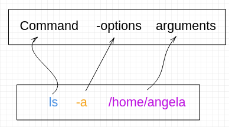
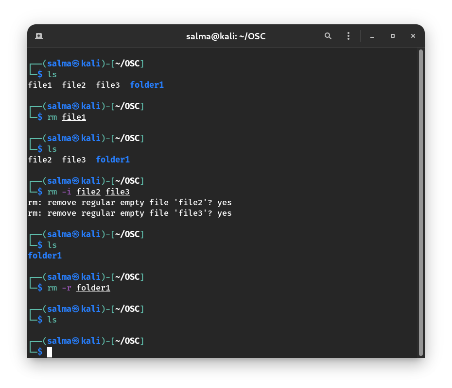

# Shell

It's a program that takes commands from the keyboard and gives them to the operating system to perform. (interprets and executes command line)

Different Types of Shells in Linux : bash, sh, zsh …etc

**The shell is the first user-friendly layer that a user can use to interact with the operating system.**

# The Command Line Syntax

When ordering the computer to do something, i.e. giving it a command, you have to take care of the syntax.

Just like programming languages, the Linux shell has specific syntax that you have to use. Just so that it could be understood by the shell.

**The syntax goes as follows:**



**The Command:** Intuitively, this is the command that you give to the system, i.e. delete, move, copy, list, etc..

**The option:** Modifies the action of the command.

  - **Example:** List “ALL” files, delete “recursively”, show the first “40” lines of a file, delete the file “by force”

**The Arguments:** What you’re going to apply the command to. i.e. Delete (command) a certain file (argument). 

**We can say in short that the options modify the command’s effect on the argument.**

# `ls` Command

`ls` – **lists** the content of a directory(folder).

Running the command ls does the following:


But that format isn’t really good if you want a detailed view, so we add the ```-l``` option which makes it list the content but in a “long” form:


Much better! Everything is cleaner and organized in a list.

How about we take a look at the hidden files too?

The ```-a``` option lists “all files”, this command can be shortened down to ```ls -la``` or ```ls -al```

**Note:** Hidden files and directories in Linux start their name with a dot `.`.


# `pwd` Command

You opened a terminal, now what?

The first thing you want to do is to know where the terminal is working:

`pwd`: **Print Working Directory**, tells you the directory your terminal is working in.


# `cd` Command

Now that you know where you are in the system, you should see the content of the directory using the `ls` command.


What if we wanted to enter the Pictures directory?

`cd`: **Change Directory**, changes the working directory to the specified argument.


# Creating Directories
  
What if we wanted to create a directory inside our current directory?

- `mkdir [name]` : **Make directory**. Creates a directory with the specified name.    

    


> Note: We use double quotes ``“ ”`` if the name of the directory has more than one word. This is to avoid making the shell interpret the 2 words as 2 separate arguments.


# Creating Files 

You can use ``touch`` to create an empty file, like`` mkdir`` you can pass as many arguments to it, and it’ll create the files for you.

If you want to create 2 files:``touch file1 file2``

**Example :**


# Renaming and Moving Files 

To rename a file use: ``mv``
    
**Example:**

Create a file that is called file1 and rename it to `textfile`.


To move “cut” a file use`` mv``

**Example:**

Moving `textfile` from `~/one` to `~/two`


| Command | Description |
|---------|-------------|
|`mv [file] [destination directory]`       | To move file.|
|`mv file_1 file_2 [destination directory]`| To move more than one file.|
|`mv oldFile newFile`                      | To rename a file or directory.|

# Deleting Files and Directories

`rm`: **Remove** files or directories(folders)



|     Command            | Description |
|------------------------|-------------|
|`rm filename`           | Removes a file.|
| `rm -i filename`       | Deletes a file but ask for confirm before.|
| `rm -f filename`       | Deletes by force and don't prompt the user.|
| `rm -d directory_name` | Deletes an empty directory.|
| `rm -r directory_name` | Deletes a non-empty directory. |